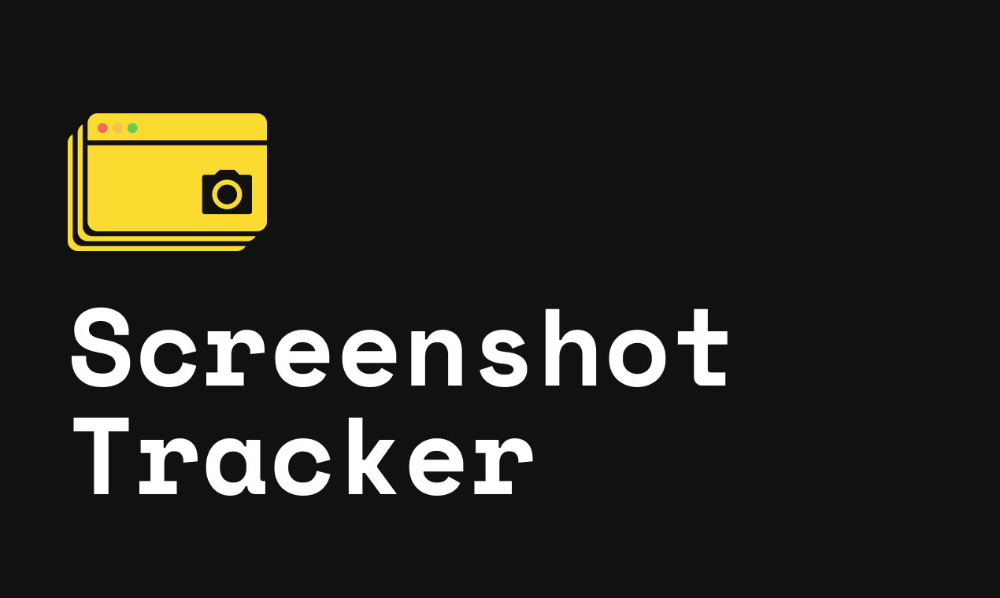

# Screenshot Tracker Desktop App



A simple screenshot tarcking tool based on electron's embedded chromium and pupeteer.


## Screenshots

[](./__assets/for_github_readme/Gallery1.jpg)

[](./__assets/for_github_readme/Gallery2.jpg)

[](./__assets/for_github_readme/Gallery3.jpg)

[](./__assets/for_github_readme/Gallery4.jpg)


### Features / Tech Used

- Electron
- Webpack 8
- Babel 7
- React 16
- ES6
- PostCSS
- Sass (Injection by modules and in the traditional way)
- Ant Design (Global theme based on the Less Ant variables)
- Jest
- Enzyme
- Eslint
- Hot realod
- Friendly architecture
- Export for Mac, Linux, Windows


### Known issues

Looking for support for the following known issues:

- Ability to capture cookie/session and use in screenshot sessions
- True mobile device emulation (right now just the resolution/width is simulated)
- App is not working on Linux and Windows Operating Systems due to puppeteer and
  electron/chromium connection
  ([#8](https://github.com/nomadinteractive/screenshot-tracker/issues/8),
  [#11](https://github.com/nomadinteractive/screenshot-tracker/issues/11))
- Testing on Wimdows
- Testing on Linux
- Writing proper react component tests. Right now tests folder only contains
  tests from original boilerplate code. They are not in proper use.


### Table of contents

* [Install](#install)
* [Usage](#usage)
* [License](#license)

### Install

#### Clone this repo

```
git clone https://github.com/nomadinteractive/screenshot-tracker
```

#### Install dependencies

```
npm install
```
or
```
yarn
```

### Usage

#### Run

```
npm start
```
or
```
yarn start
```

#### Build (manual)

```
npm run build
```
or
```
yarn build
```

#### Prod (Preview in Production)

```
npm run prod
```
or
```
yarn prod
```

#### Build package (Current OS)

```
npm run package
```
or
```
yarn package
```

#### Build package (Mac, Linux, Windows)

```
npm run package:all
```
or
```
yarn package:all
```

#### Test

```
npm test
```
or
```
yarn test
```

#### Docs

```
npm run docs
```
or
```
yarn docs
```

### License

MIT © [Nomad Interactive](https://github.com/nomadinteractive/screenshot-tracker/blob/master/LICENSE)

Boilerplate derived from
[Leonardo Rico](https://github.com/kevoj/electron-react-ant-boilerplate/blob/master/LICENSE)
via MIT license
